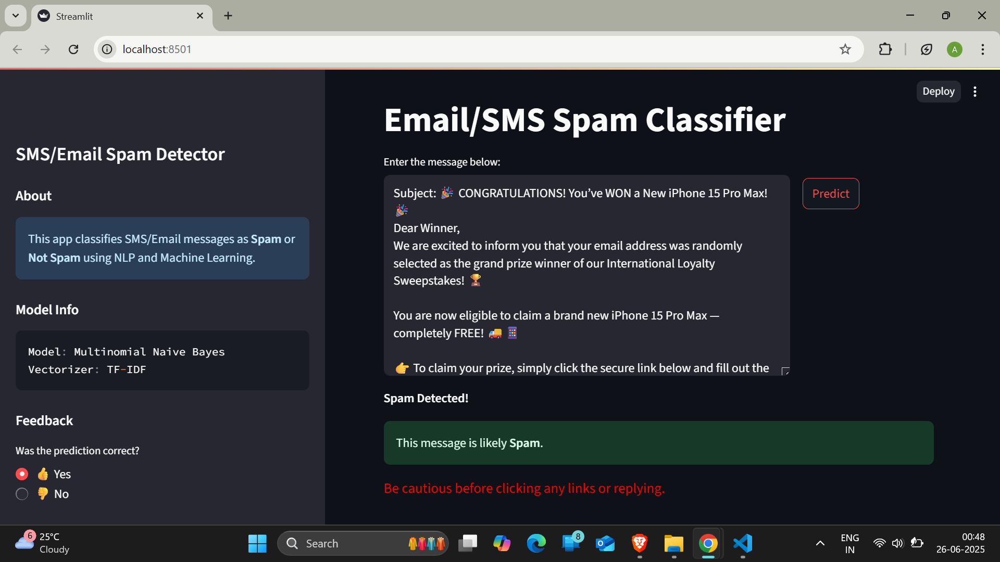
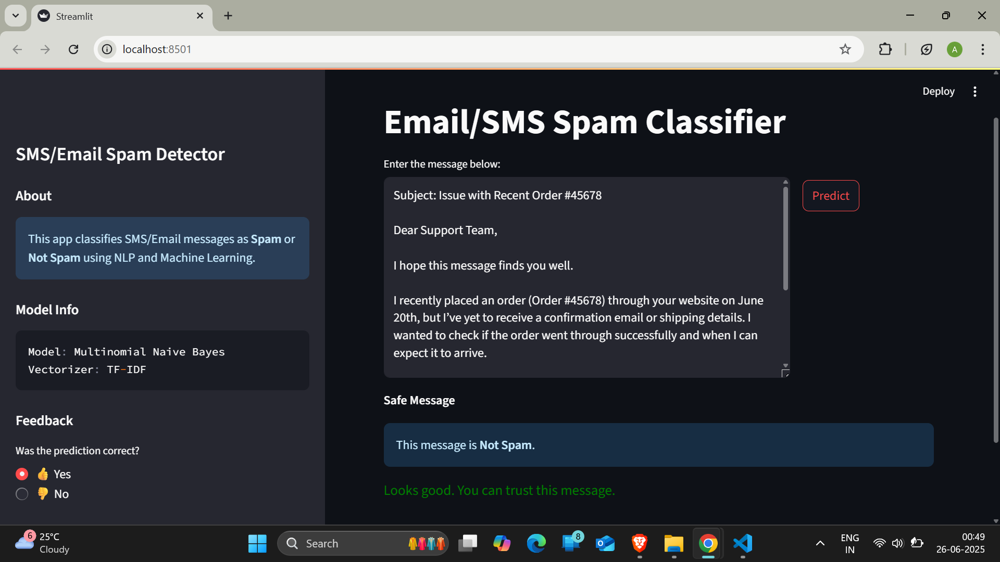

# SMS/Email Spam Detection App

**Live Demo**: [Click here to try the app!](https://smsemailspamdetection.streamlit.app/)

This is a web application that classifies SMS and Email messages as **Spam** or **Not Spam** using **Natural Language Processing (NLP)** and a **Multinomial Naive Bayes** machine learning model. The app is built using **Python** and **Streamlit**, and also supports **batch message classification** from `.txt`, `.pdf`, or `.docx` files.

---
## 🖼️ Screenshots

### Spam Prediction


---

### Not Spam Prediction


---

## Objective

To develop a user-friendly, interactive spam classification app that:
- Predicts whether a message is spam
- Displays a confidence score
- Allows users to upload files with multiple messages
- Is easy to use and accessible via a browser

---

## Features

- Classify single text input (SMS/email)
- Upload `.txt`, `.pdf`, or `.docx` files for batch classification
- Clean UI built with Streamlit
- Feedback option to collect user validation

---

## Technologies Used

| Component      | Tool / Library               | Purpose                                           |
|----------------|------------------------------|---------------------------------------------------|
| Language       | Python 3                     | Core language                                     |
| UI             | Streamlit                   | Web app interface                                 |
| NLP            | NLTK                        | Tokenization, stopwords, stemming                 |
| ML Model       | Scikit-learn                | TF-IDF vectorizer and Naive Bayes classifier      |
| File Handling  | PyPDF2, python-docx         | Parsing PDF and Word files                        |
| Batch Support  | Pandas                      | Data handling and table output                    |
| Deployment     | Streamlit Cloud (optional)  | Hosting the web app online                        |

---

## How the Model Works

1. **Dataset Used**: [SMS Spam Collection](spam.csv)
   - ~5,500 labeled SMS messages (`spam` or `not spam`)
2. **Preprocessing**:
   - Lowercasing, tokenization (`nltk.word_tokenize`)
   - Removing punctuation and stopwords
   - Stemming using `PorterStemmer`
3. **Vectorization**:
   - TF-IDF (Term Frequency–Inverse Document Frequency)
   - Transforms text into numerical vectors
4. **Model**:
   - Trained a **Multinomial Naive Bayes** model using `scikit-learn`
   - Achieves high accuracy on test set
5. **Prediction Output**:
   - Shows label (`Spam` / `Not Spam`) and prediction confidence

---

## How to Run Locally

1.Clone the Repository
```bash
git clone https://github.com/awantigiradkar/SMS-Email-Spam-Detection.git
cd SMS-Email-Spam-Detection
```
2. Create Virtual Environment (Optional but Recommended)
```bash
python -m venv venv
venv\Scripts\activate   # For Windows
# or
source venv/bin/activate   # For Mac/Linux
```
3. Install Dependencies
```bash
pip install -r requirements.txt
```
4. Run the Streamlit App
```bash
streamlit run app.py
```

📄 License
This project is licensed under the MIT License.

💬 Feedback
If you like this project, consider ⭐ starring the repo.
Have suggestions or found bugs? Open an issue or contribute via pull request!


